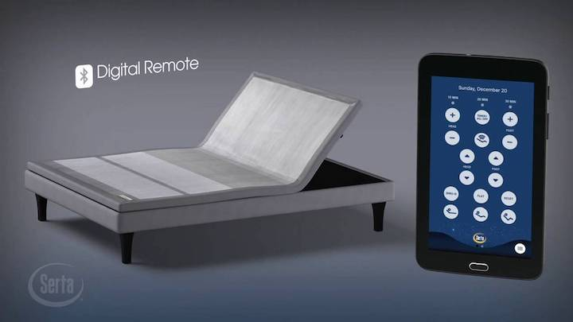

# Serta Motion Perfect III BLE IoT Integration

## Background

The Serta Motion Perfect III adjustable base bed frame can be controlled via Bluetooth LE from either the provided remote controls or the mobile app for Android and iOS. The product is actually built by [Ergomotion](http://www.ergomotion.com/Support/Serta) and sold by Serta.

One of the disadvantages of the wireless remote is that if you are trying to get comfortable, moving around to find the remote and hunt for the buttons in the dark just to adjust the bed is pretty counter intuitive IMO. The mobile app experience is even worse as you have to find your phone, unlock it, open the app and manually pair the device each time before you can even start adjusting the position. Ew.

The purpose of this project is to maximize consumer laziness and create a voice activated adjustable bed. Yes, the perfect weekend project for a software engineer and casual wireless hacker.

----

Demo video:

----

Before getting started it's a good idea to become familiar with the [BLE protocol](https://learn.adafruit.com/introduction-to-bluetooth-low-energy/introduction) if you haven't worked with it before.

You should also be somewhat familiar with [AWS](https://aws.amazon.com/), [Lambda](https://aws.amazon.com/lambda/), [IoT](https://aws.amazon.com/iot/) and the [Alexa Skills Kit](https://developer.amazon.com/alexa-skills-kit). You don't have to be an expert since the purpose of this guide is to walk you through my journey with these services.

Jump to each of this guide:

- [Sniffing the BLE Protocol](./docs/01_BLE_SNIFFING.md)
- [Controlling with CHIP or Raspberry Pi 3](./docs/02_BLE_CONTROL.md)
- [Create AWS IoT Device](./docs/03_IOT_DEVICE.md)
- [Create AWS Lambda Function](./docs/04_LAMBDA.md)
- [Create the Custom Alexa Skill](./docs/05_ALEXA_SKILL.md)
