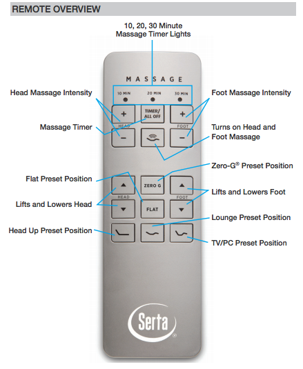
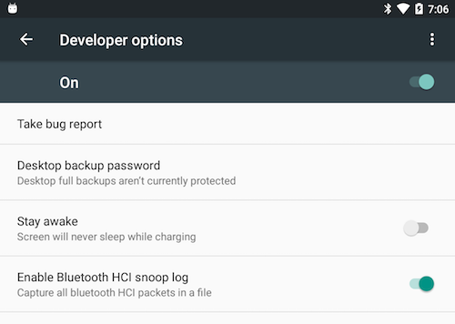
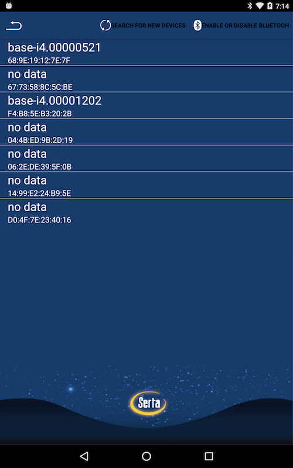
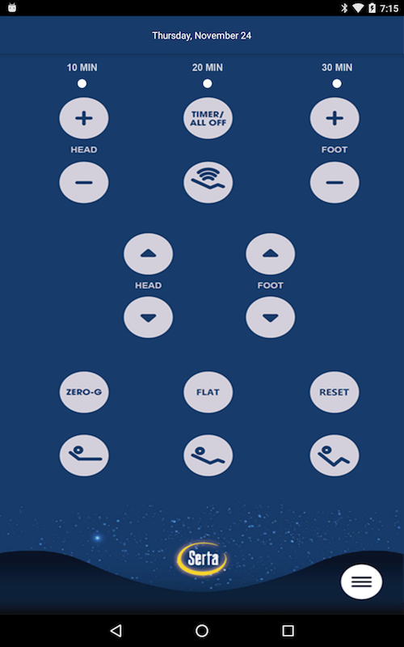
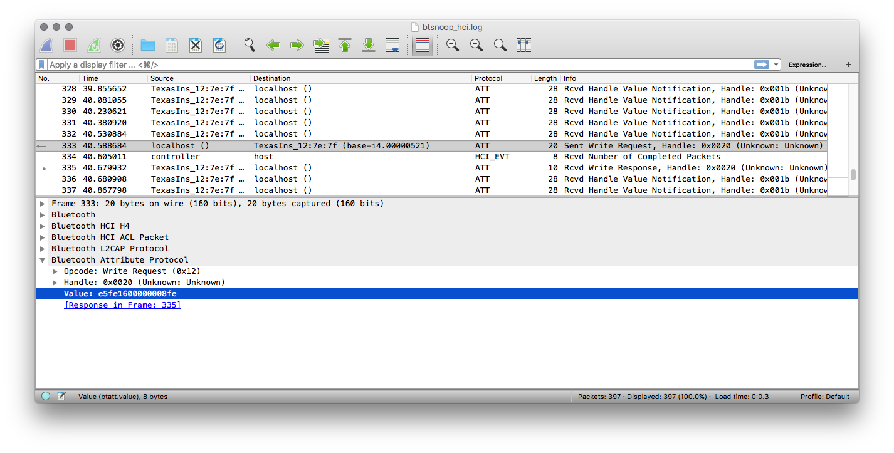

# Reverse Engineering the BLE Protocol

The remote control communicates with the bed via BLE, you can also control it from a smartphone or tablet using the mobile app.



Capturing the BLE packets was actually a lot easier than I expected once I realized the developer mode on Android OS dumps the HCI packets from any app to a file. For the record, I did end up [decompiling the apk to smali](https://github.com/JesusFreke/smali) and tried to derive the protocol from the code but in the end the packet capture was much easier.

You can also get packets the HARDware way using something like the [Bluefruit LE Sniffer](https://learn.adafruit.com/introducing-the-adafruit-bluefruit-le-sniffer/introduction).

### Dumping packets on Android

Using a Nexus 7 tablet with Android v6.0.1, I enabled developer mode by going to `Settings` -> `About tablet` the tap `Build number` 7 times until developer mode was enabled.

Then, under `Settings` -> `Developer options` and enable the `Enable Bluetooth HCI snoop log` setting. This will write all BLE packets to the file: `/sdcard/btsnoop_hci.log`.



Install the [Serta MP Remote app](https://apk-dl.com/serta-mp-remote/) for Android OS. Open the app and configure it to connect to your base.





Push a button on the app interface, for example `Flat` you should hear the bed actuate confirming that the command was received.

Now download the log file to your computer:

```
adb pull /sdcard/btsnoop_hci.log
```

Open [`btsnoop_hci.log`](./docs/btsnoop_hci.log) file in wireshark.



What we're looking for here is a write request sent from the tablet to the device. In the screenshot above, you can see a write request was sent to the handle `0x0020` with data `e5:fe:16:00:00:00:08:fe`

Repeat this for the different button presses to create a map of the buttons to write commands.

```
e5fe1600080000fe -> Massage Head Add
e5fe160000800086 -> Massage Head Min
e5fe1600000008fe -> Flat Preset
e5fe1600100000f6 -> ZeroG Preset
e5fe160004000002 -> Massage Foot Add
e5fe160000000105 -> Massage Foot Min
e5fe160001000005 -> Head and Foot Massage On
e5fe160002000004 -> Massage Timer
e5fe160100000005 -> Lift Head
e5fe160200000004 -> Lower Head
e5fe160400000002 -> Lift Foot
e5fe1608000000fe -> Lower Foot
e5fe160080000086 -> Head Up Preset
e5fe1600200000e6 -> Lounge Preset
e5fe1600400000c6 -> TV/PC Preset
```

### Derived Command format

Example Command (Massage Head Add):

```
addr (3 bytes)   keycode (4 bytes)  checksum (1 byte)
e5fe16           00080000           fe
```

Looking at the pattern in the sniffed commands this is an 8 byte command protocol with a checksum.

The checksum appears to be an XOR with 0xFF on the sum of the addr and keycode bytes. For example:

```
# Checksum for Massage Head Add
python -c 'print(hex((0xe5 + 0xfe + 0x16 + 0x00 + 0x08 + 0x00 + 0x00) ^ 0xff))'
0x2fe

# Checksum for TV/PC Preset
python -c 'print(hex((0xe5 + 0xfe + 0x16 + 0x00 + 0x40 + 0x00 + 0x00) ^ 0xff))'
0x2c6
```

> Just take the first byte in the checksum and make that the checksum byte

### Control Methods

It doesn't appear that there is a way to command the massage to 'off' or even directly set the head or foot angles directly. In the app it appears that the "presets" you can create are commanded open-loop with some process that reads back the current angle and continues to send commands until the angles match. Pretty lame if you ask me.

Without further decoding of the status and telemetry packets, it will be hard to reproduce this kind of control but hopefully it's good enough.

-----

Next, we [control the bed with a CHIP or Raspberry Pi](./02_BLE_CONTROL.md).
